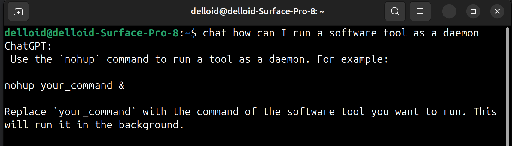
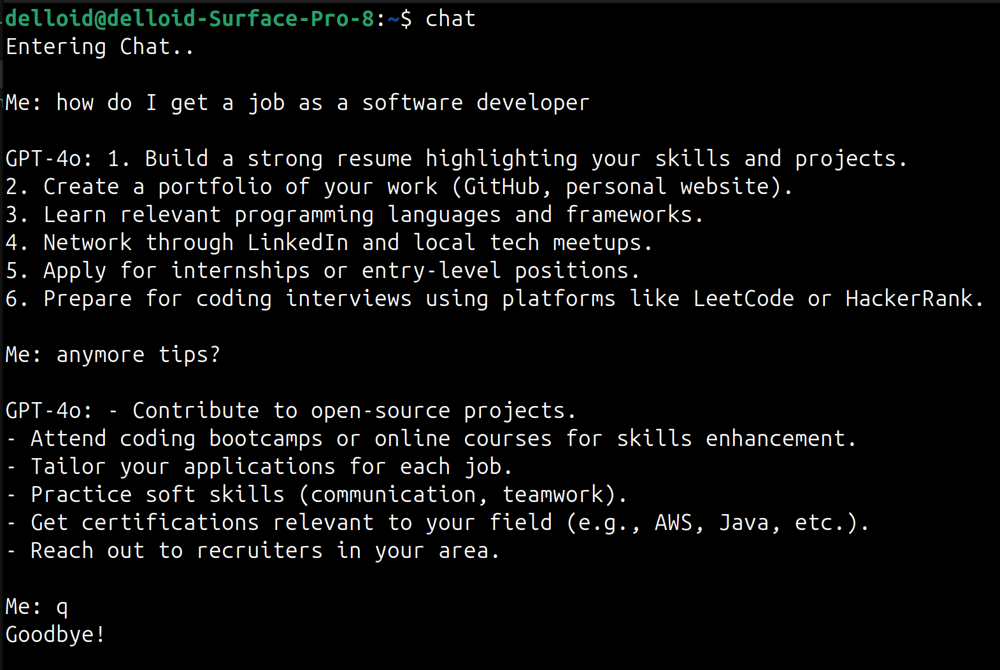

# Shell-GPT
Shell-GPT is a command-line interface (CLI) tool that integrates OpenAI's GPT-4o model to provide AI-powered assistance directly within the terminal. Designed specifically for Ubuntu 20.04 LTS, Shell-GPT delivers concise and focused responses.
### Features
- **Global Terminal Integration:** Interact with GPT-4o from any working directory.

- **System Context Awareness:** The AI is aware of the Ubuntu 20.04 LTS environment, providing relevant commands and solutions.
### Example usage
One-shot quick responses:
```chat <your inquiry>```

Create a chat: ```chat```



## Installation
1. Clone git repo\
```git clone https://github.com/BJarboe/shellgpt.git```
2. Use pipx for dependency, creating a dedicated virtual environment for running the chatbot\
```pipx install openai && pipx ensurepath```
3. Create alias for command\
```alias chat='python3 /path/to/shellgpt```
4. Create environmental variable\
```export OPENAI_API_KEY="your-key"```
5. Restart terminal :)